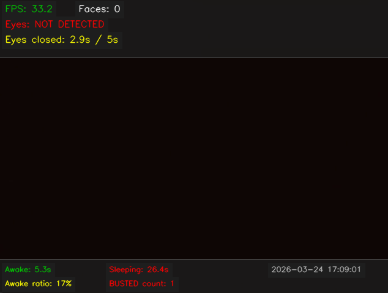

# Sleeper Detection

Real-time drowsiness detection using [OpenCV](https://opencv.org/) Haar cascades. Detects face and eyes from webcam or video — if eyes close for 5 seconds, saves a **BUSTED!** screenshot with timestamp.

## How to Run

```powershell
python -m venv .venv
.\.venv\Scripts\Activate.ps1
pip install -r requirements.txt
python detector.py
```

Requires Python 3.10+. If execution policy blocks activation:

```powershell
Set-ExecutionPolicy -ExecutionPolicy RemoteSigned -Scope CurrentUser
```

To use a video file instead of webcam:

```powershell
python detector.py --source video.mp4
```

## How It Works

1. Capture frame from webcam/video
2. Convert to grayscale, apply histogram equalization
3. Detect faces via `detectMultiScale()`
4. Search for eyes in the upper 65% of each face ROI
5. If ≥2 eyes found → state = **awake**
6. If eyes were previously seen but missing for 5s → **BUSTED!**
7. Save screenshot with overlay text and timestamp to `screenshots/`

## Haar Cascades

| Cascade | File | Region |
|---------|------|--------|
| Face | `haarcascade_frontalface_default.xml` | Full frame |
| Eyes | `haarcascade_eye.xml` | Upper 65% of face |
| Smile | `haarcascade_smile.xml` | Lower 50% of face |

All cascades ship with `opencv-python` and are loaded via `cv2.data.haarcascades`.

## Parameters

| Flag | Description | Default |
|------|-------------|---------|
| `--source` / `-s` | Camera index or path to video file | `0` |
| `--threshold` / `-t` | Seconds without eyes before BUSTED | `5.0` |
| `--no-smile` | Disable smile detection | off |

## Controls

| Key | Action |
|-----|--------|
| `q` / `ESC` | Quit |
| `s` | Manual screenshot |

## Bonus Features

- **Awake vs. sleep time** — tracked and displayed in the bottom panel
- **Awake ratio** — percentage of time with eyes open
- **BUSTED counter** — total number of BUSTED events
- **Smile detection** — detects smiles in the lower face region
- **Warning flash** — red border blinks 2 seconds before BUSTED triggers
- **Session stats** — printed to console on exit

## Output

The program displays a live window with:

- Cyan rectangles around detected faces
- Green rectangles around detected eyes
- Magenta rectangles around detected smiles
- Top panel with FPS, face count, eye status, and countdown timer
- Bottom panel with awake/sleep stats

When BUSTED triggers, a screenshot is saved to `screenshots/` with a large red **BUSTED!** label and the current date/time.

### Detection Window


